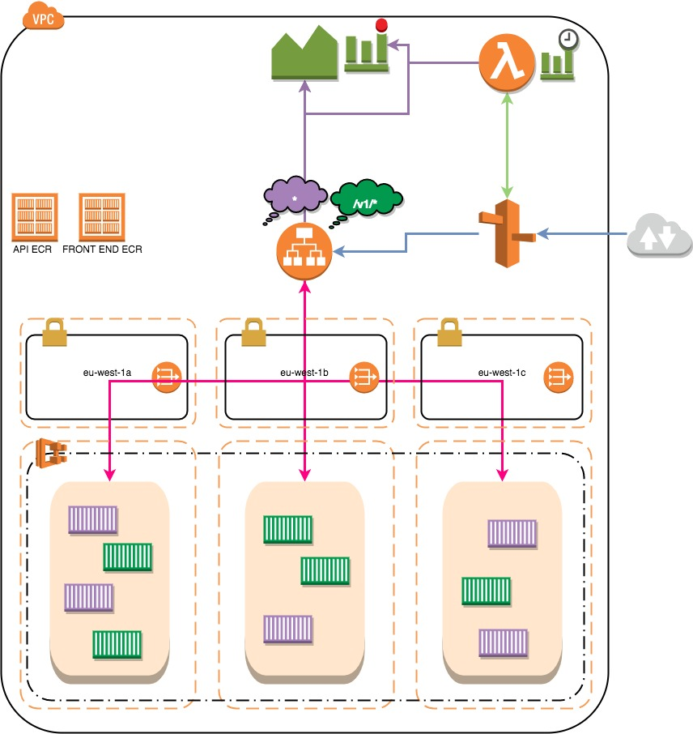

[](https://goreportcard.com/report/github.com/DavyJ0nes/ecs-demo)
# ECS Demo

## Description
This is a collection of demo Golang, dockerised web applications that are deployed using [AWS ECS](https://aws.amazon.com/ecs/getting-started) behind an Application Load Balancer that is set up for [Content Based Routing](http://docs.aws.amazon.com/elasticloadbalancing/latest/application/tutorial-load-balancer-routing.html).

They are super basic and lightweight and their only purpose is to be used for demoing how to use ECS with an Application Load Balancer and Content/Path based routing.

## Archiutecture


## Repo Structure
This repo is divided into two parts; the apps and the infrastructure provisioning.

### Apps
The apps are simple microservices that are coded in Golang and built as Docker images.

#### How to deploy
Within each of the application directories there is a `Makefile` that can be used to standardise creation of the binaries and Docker images. here are the list of commands available:

```
# Creates the statically linked and compiled golang binary using a standard golang docker container as the build environment.
make binary

# Builds the Docker image using the Dockerfile
make image

# Runs the image locally in Docker after building the image
make run

# Builds the Docker image and publishes it to a repository defined with the environment variable ECR_REPO
# Use this as the main build command
make publish
```

#### How to test
As each of the applications are built using golang I have created some tests to check their intended functionality. They can be run by changing into the relevant app directory and running: `make test`. This spins up a docker container running Golang, which then runs the test files.

### Infrastructure
The infrastructure provisioning is done using [Terraform](https://www.terraform.io). Currently I just have the one stack (dev) but this can be exapanded on to create other environments, such as prod, canary etc.

#### How to deploy
There is a Makefile within the root of the repository that contains helper commands to help easiliy deploy the artifacts to your AWS cloud.

#### How to test
Once the stack has been deployed using Terraform then we can use [AWSpec](https://github.com/k1LoW/awspec) to run some acceptance tests on the infrastructure to ensure that everything is running as expected.

This can be done using the Make file with the following command: `make test`. This installs the relevant ruby gems and then runs rake on the test specs.

```
├── Makefile
├── README.md
├── Terraformfile
├── apps
│   ├── api
│   │   ├── Dockerfile
│   │   ├── Makefile
│   │   ├── env-example
│   │   └── main.go
│   └── front_end
│       ├── Dockerfile
│       ├── Makefile
│       ├── env-example
│       └── main.go
└── terraform
    ├── Gemfile
    ├── Gemfile.lock
    ├── Rakefile
    ├── env
    │   └── dev
    │       ├── api_definition.json
    │       ├── dev.example.tfvars
    │       ├── dev.tf
    │       ├── dev.tfvars
    │       ├── front_end_task.json
    │       ├── outputs.tf
    │       ├── terraform.tfstate.backup
    │       └── variables.tf
    ├── modules
    │   ├── ecr
    │   │   ├── README.md
    │   │   ├── ecr.tf
    │   │   ├── outputs.tf
    │   │   └── variables.tf
    │   ├── ecs
    │   │   ├── README.md
    │   │   ├── cluster
    │   │   └── service
    │   └── vpc
    │       ├── README.md
    │       ├── outputs.tf
    │       ├── variables.tf
    │       └── vpc.tf
    └── spec
        ├── dev_spec.rb
        └── spec_helper.rb
```

# LICENSE
MIT
